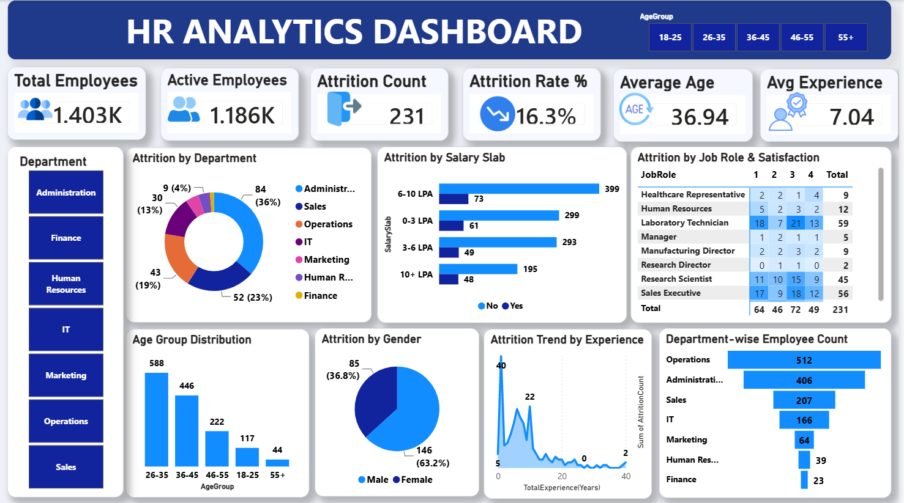

# 📊 HR Analytics Dashboard | Power BI

An interactive HR Analytics Dashboard developed using Microsoft Power BI to analyze employee demographics, attrition, compensation, job satisfaction, performance, and workforce characteristics.

## 🎯 Project Objective

The objective of this project is to transform employee data into meaningful HR insights that can help organizations understand workforce trends, identify factors associated with employee attrition, and support data-driven HR decision-making.

## 🗂️ Dataset

The dataset contains 1,480 employee records and 37 attributes covering:

- Employee demographics
- Department and job roles
- Salary and compensation
- Employee attrition
- Job satisfaction
- Environment satisfaction
- Work-life balance
- Overtime
- Performance
- Work experience
- Training
- Promotion and manager tenure

## 🛠️ Tools & Technologies

- Microsoft Power BI
- Power Query
- DAX
- Microsoft Excel / CSV
- Data Visualization
- Data Analysis

## 🔄 Project Workflow

1. Imported employee dataset into Power BI
2. Performed data cleaning and transformation using Power Query
3. Checked data types and missing values
4. Created calculated measures using DAX
5. Developed interactive visualizations
6. Added filters and slicers for dynamic analysis
7. Analyzed employee attrition and workforce patterns
8. Presented insights through an interactive dashboard

## 📌 Key KPIs

The dashboard analyzes key HR metrics such as:

- Total Employees
- Active Employees
- Attrition Count
- Attrition Rate
- Average Age
- Average Experience

## 📈 Dashboard Analysis

The dashboard provides insights into:

- Employee attrition trends
- Department-wise workforce distribution
- Job role analysis
- Salary and compensation patterns
- Employee demographics
- Overtime and attrition
- Job satisfaction
- Work-life balance
- Experience and tenure
- Performance and training

## 💡 Key Dataset Insights

- The dataset contains 1,480 employees.
- 241 employees have left the organization.
- The overall attrition rate is approximately 16.3%.
- Operations is the largest department in the dataset.
- Employee satisfaction, overtime, compensation, experience, and tenure can be explored as potential factors associated with attrition.

## 📸 Dashboard Preview



## 🚀 How to Use

1. Download the repository.
2. Open `PowerBI/HR_Analytics_Dashboard.pbix` using Microsoft Power BI Desktop.
3. If required, update the dataset path in Power BI.
4. Refresh the data.
5. Interact with the dashboard using available filters and slicers.

## 📁 Repository Structure

```text
HR-Analytics-PowerBI-Dashboard/
│
├── Dataset/
│   └── HR_Analytics.csv
│
├── PowerBI/
│   └── HR_Analytics_Dashboard.pbix
│
├── Screenshots/
│   └── HR_Analytics_Dashboard.png
│
└── README.md
